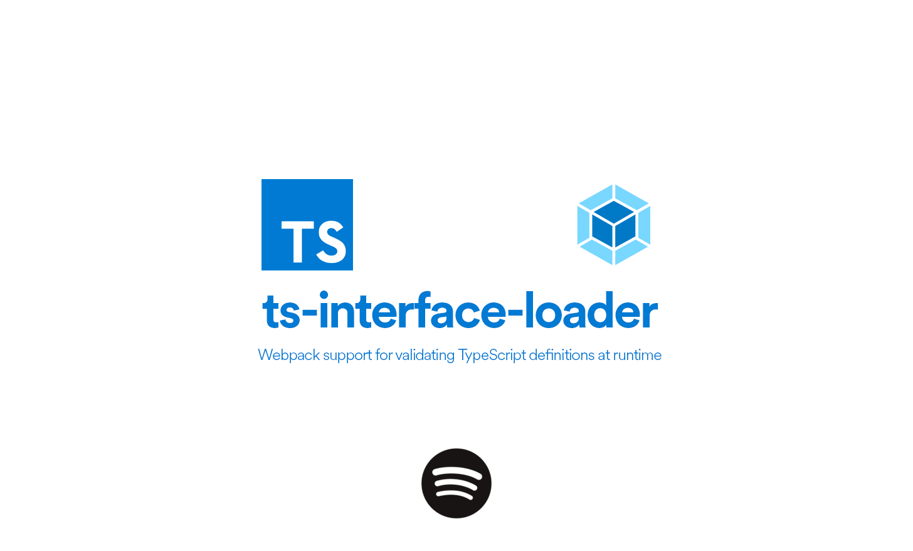

<!-- @format -->

# 

[](https://travis-ci.com/spotify/ts-interface-loader)
[](https://codecov.io/gh/spotify/ts-interface-loader)
[](../LICENSE.md)
[](../CODE-OF-CONDUCT.md)

Validate [TypeScript] definitions at runtime with [webpack] and Node 8+. Built and used at Spotify.

Common use cases:

- Provide validation for JSON files (i.e. system config)
- Testing JSON output using your existing [TypeScript] definitions.

## Intro

By design, TypeScript only provides typechecking at compile time. However it is possible to do so at runtime through [`ts-interface-builder`][ts-interface-builder] generating a JSON manifest of your definitions and [`ts-interface-checker`][ts-interface-checker] for validating those types with plain JSON / JavaScript objects.

In our case, we wanted to build the manifest automatically through Webpack. Welcome `ts-interface-loader`!

## Code Example

How does it look like in code terms?

```ts
// First, we'll want to make some TypeScript definitions.
// In this case, we have a types.ts with a IUser type interface.
//
export interface IUser {
  first_name: string
  last_name: string
  office_location: 'stockholm' | 'gothenburg' | 'london' | 'new york' | 'boston'
}

// Secondly, we'll write our app.ts (which will run with Webpack)
//
import {createCheckers, ITypeSuite} from 'ts-interface-checker'
import typesTI from 'ts-interface-loader!./types'
// import {IUser} from './types'

const validPayload = {first_name: 'Daniel', last_name: 'Ek'}
const invalidPayload = {first_name: 'Daniel', last_name: 123}

try {
  createCheckers(typesTI).IUser.check(invalidPayload)
} catch (err) {
  console.log(err.message) // => "value.last_name is not a string"
}

// Or, if we want to validate in "strict" mode
// It's the same as above, except column presence is required.
//
const validStrictPayload = {first_name: 'Daniel', last_name: 'Ek', office_location: 'stockholm'}
const invalidStrictPayload = {first_name: 'Daniel', last_name: 'Ek'}

try {
  createCheckers(typesTI).IUser.strictCheck(invalidStrictPayload)
} catch (err) {
  console.log(err.message) // => "value.office_location is missing"
}
```

For a more in-depth sample, take a look [at our sample project](../example).

## Getting started

### Install

```bash
$ npm install --dev ts-interface-loader
$ yarn add --dev ts-interface-loader
```

### Import `ts-interface-loader` in your TypeScript code (`.ts` or `.tsx`)

```js
// ES6 Modules
import typesTI from 'ts-interface-loader!./types'

// ES5 (CommonJS)
const typesTI = require('ts-interface-loader!./types')
```

> **Note:** Using `tsc` or `tslint`? You'll need to add `@ts-ignore` and `tslint:disable-line:no-implicit-dependencies` for now, as there is no support (natively or through plugins) for supporting [importing webpack loaders inline](https://webpack.js.org/concepts/loaders/#inline).
>
> ```js
> // @ts-ignore
> import typesTI from 'ts-interface-loader!./types' // tslint:disable-line
> ```

## Development

### Clone the repository

```bash
$ git clone https://github.com/spotify/ts-interface-loader.git
$ cd ts-interface-loader/
$ yarn install
```

### Run

```bash
# Get started
$ yarn build
$ cd example/
$ yarn watch

# Run some commands!
$ cat src/__fixtures__/ok-all-matching-types.json | yarn run --silent cli | jq '.manifestJson'
$ cat src/__fixtures__/error-no-tvshows-key.json | yarn run --silent cli | jq '.manifestValidator'
$ cat src/__fixtures__/error-no-tvshows-key.json | yarn run --silent cli | jq '.manifestStrictValidator'

# Take a look at other fixtures!
$ cd src/__fixtures__
```

## Test

Run the following command

```bash
$ yarn test
```

## Contributing

We strictly adhere to the [Contributor Covenant](../CODE-OF-CONDUCT.md) in this repository, and wish to foster an open source culture that's welcoming and diverse.

Pull requests and stars are always welcome. For bugs and feature requests, please [create an issue](https://github.com/spotify/ts-interface-loader/issues?q=is%3Aissue+is%3Aopen+sort%3Aupdated-desc).

1. Fork it!
1. Create your feature branch: `git checkout -b my-new-feature`
1. Commit your changes: `git commit -am 'Add some feature'`
1. Push to the branch: `git push origin my-new-feature`
1. Submit a pull request :)

[typescript]: https://www.typescriptlang.org/
[webpack]: https://webpack.js.org
[ts-interface-builder]: https://github.com/gristlabs/ts-interface-builder
[ts-interface-checker]: https://github.com/gristlabs/ts-interface-checker
